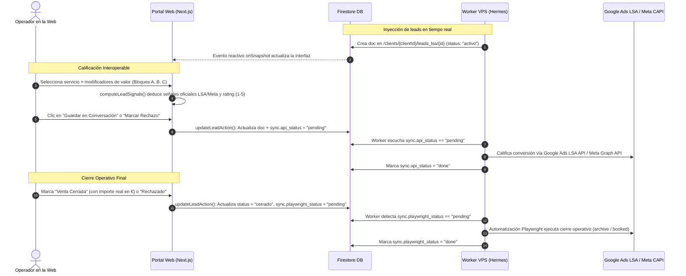

# Arquitectura y Pipeline: Calificación, Cierre y Sincronización (Web ↔ Firestore ↔ VPS Hermes)

Esta guía documenta el funcionamiento integral del sistema para que cualquier desarrollador comprenda el flujo de datos entre la plataforma web (Next.js), la base de datos (Google Cloud Firestore) y los workers automatizados en el VPS (`hermesbot`).

---

## 1. Topología de Colecciones en Firestore

Cada empresa cliente registrada en el área privada (`palma`, `shalom`, `jg`) posee sub-colecciones segmentadas por canal publicitario:

```text
/clients/{clientId}/
    ├── leads_lsa/{leadId}        # Leads provenientes de Google Local Services Ads (LSA)
    └── leads_meta/{leadId}       # Leads captados a través de Meta Ads (Facebook/Instagram)
```

- **ID de Clientes Actuales:**
  - `palma` (Mudanzas Palma)
  - `shalom` (Mudanzas Shalom)
  - `jg` (Mudanzas JG)
- **Control de Acceso Multi-Cliente:**
  - Definido en `/client_members/{userId}_{clientId}`.
  - El usuario activo conmuta entre clientes mediante la cookie `portal_client_id`, cargando dinámicamente sus respectivas subcolecciones.

---

## 2. Ciclo de Vida y Pipeline de un Lead



---

## 3. Estructura del Documento Lead en Firestore

Cuando la web califica o cierra un lead, actualiza el documento con la siguiente estructura estricta:

```typescript
{
  // 1. Datos operativos y contacto
  "id": "lsa_335433531",
  "client_id": "jg",
  "channel": "google_lsa",          // "google_lsa" | "meta_ads"
  "status": "en_conversacion",       // "activo" | "en_conversacion" | "cerrado" | "rechazado"
  "contact_name": "Carlos Mendoza",
  "phone": "+34600000000",
  "created_at": "2026-03-12T10:18:00Z",

  // 2. Hechos operativos registrados por el usuario
  "qualification": {
    "service": "mudanza_mediana",   // Servicio base
    "has_storage": true,            // Toggle Guardamuebles
    "has_elevator": false,          // Toggle Elevador / Grúa
    "is_national": true,            // Toggle Mudanza Nacional
    "price_range": "500_1000",      // "<250" | "250_500" | "500_1000" | "+1000" | null
    "status": "en_conversacion",    // "en_conversacion" | "venta" | "rechazado"
    "sale_amount": null,            // Importe monetario cerrado en € (solo si status === "venta")
    "qualified_at": "2026-10-01T12:00:00Z"
  },

  // 3. Señales deducidas automáticamente por el motor
  "score": 5,                       // Rating algorítmico interno (1 a 5)
  "computed_signals": {
    "internal_rating": 5,
    "lsa_sentiment": "VERY_SATISFIED",   // Enum oficial Google Ads LSA
    "lsa_reason": "HIGH_VALUE_SERVICE",  // Enum oficial Google Ads LSA
    "meta_event": "QualifiedLead",       // Enum oficial Meta CAPI
    "meta_value": null,                  // Valor en € para Meta ROAS (solo compras reales)
    "playwright_action": null            // "archive" | "booked" | null (solo al cerrar)
  },

  // 4. Cola de sincronización para el worker Hermes en el VPS
  "sync": {
    "api_status": "pending",        // "pending" -> Hermes califica vía API -> "done"
    "playwright_status": null       // Permanece null hasta el cierre definitivo ("pending" -> "done")
  }
}
```

---

## 4. Matriz de Deducción y Reglas de Negocio Específicas

El archivo `lib/portal/qualification.ts` centraliza las reglas algorítmicas:

### A. Descartes Claros (Incompatibilidad Universal)
Aplica a cualquier lead que sea:
- **`spam_empleo`** (LSA: `SOLICITATION` / Meta: `DisqualifiedLead` / Rating: **1**)
- **`fuera_zona`** (LSA: `GEO_MISMATCH` / Meta: `DisqualifiedLead` / Rating: **1**)
- **`porte_bulto`** o **`furgoneta`** (LSA: `JOB_TYPE_MISMATCH` / Meta: `DisqualifiedLead` / Rating: **1**)

> **Regla UI:** Bloquea de inmediato el estado comercial a **Rechazado** e impide guardar en "En Conversación" o "Venta".

### B. Reglas Particulares por Cliente

1. **Mudanzas con Elevador / Grúa (`has_elevator: true`):**
   - **`palma`:** Cuenta con maquinaria propia. Es considerado **servicio de alto valor** (`VERY_SATISFIED`, `HIGH_VALUE_SERVICE`, Rating: **5**).
   - **`jg` y `shalom`:** No disponen de elevador propio. Cualquier lead con elevador se negativiza automáticamente a **Rating 1** (`JOB_TYPE_MISMATCH`, `VERY_DISSATISFIED`, `DisqualifiedLead`) y se fija como **Rechazado**.

2. **Mudanzas Nacionales (`is_national: true`):**
   - **`palma` y `jg`:** Operan a nivel nacional. Suma valor máximo a la calificación (`VERY_SATISFIED`, `HIGH_VALUE_SERVICE`, Rating: **5**).
   - **`shalom`:** Únicamente opera en ámbito local/regional. Toda mudanza nacional se negativiza automáticamente a **Rating 1** (`GEO_MISMATCH`, `VERY_DISSATISFIED`, `DisqualifiedLead`) y se fija como **Rechazado**.

---

## 5. Protocolo de Sincronización con el VPS (Worker Hermes)

Para evitar colisiones entre la API de Google Ads y la automatización por navegador (Playwright), el pipeline divide la sincronización en dos fases explícitas:

1. **Fase 1: Calificación Preliminar (API)**
   - Ocurre mientras el lead está en estado `en_conversacion` o descarte temprano.
   - La web escribe `sync.api_status: "pending"`.
   - Hermes procesa la calificación de satisfacción (`lsa_sentiment` / `lsa_reason`) enviando la solicitud HTTP contra la **Google Ads LSA API** / **Meta Graph API**, y concluye marcando `sync.api_status: "done"`.
   - `sync.playwright_status` permanece como `null`.

2. **Fase 2: Cierre Definitivo (Playwright)**
   - Ocurre cuando el operador resuelve el lead a `venta` (reserva cerrada) o `rechazado` (archivo definitivo).
   - La web actualiza `status` a `"cerrado"` (o `"rechazado"`) y activa `sync.playwright_status: "pending"`.
   - El script de Playwright en el VPS toma la tarea, abre la consola publicitaria correspondiente, archiva o marca como "Booked" el lead según `computed_signals.playwright_action`, y concluye actualizando `sync.playwright_status: "done"`.

---

## 6. Contrato Oficial Google Ads LSA API (RPC v23 Enums)

Para garantizar la interoperabilidad exacta entre la Web (Next.js), Firestore y el SDK de Google Ads instalado en el VPS (`hermesbot`), se utilizan estrictamente los enums oficiales de la API RPC v23:

### A. Sentimientos de Encuesta (`LocalServicesLeadSurveyAnswerEnum.SurveyAnswer`)

| Rating Interno | Valor Exacto API LSA | Significado / Traducción |
|:---:|:---|:---|
| **1** | `VERY_DISSATISFIED` | Muy insatisfecho |
| **2** | `DISSATISFIED` | Insatisfecho |
| **3** | `NEUTRAL` | Neutral |
| **4** | `SATISFIED` | Satisfecho |
| **5** | `VERY_SATISFIED` | Muy satisfecho |

> **Nota técnica:** `UNKNOWN` y `UNSPECIFIED` son valores técnicos internos de la API y quedan excluidos del operador.
>
> **Corrección Web:** Valores previos como `SOMEWHAT_DISSATISFIED` y `SOMEWHAT_SATISFIED` no existen en el SDK de Google Ads; se han unificado y traducido a `DISSATISFIED` (2) y `SATISFIED` (4) en `lib/portal/types.ts` y `lib/portal/qualification.ts`.

### B. Justificantes Positivos (`LocalServicesLeadSurveySatisfiedReasonEnum`)

Disparados cuando el lead es calificado positivamente (`SATISFIED` o `VERY_SATISFIED`):

| Valor Exacto API LSA | Traducción Orientativa | Uso en el Sistema |
|:---|:---|:---|
| `BOOKED_CUSTOMER` | Cliente que ha contratado/reservado | Cierre de venta habitual |
| `LIKELY_BOOKED_CUSTOMER` | Cliente con probabilidad de contratar | Conversación muy avanzada |
| `SERVICE_RELATED` | Consulta relacionada con el servicio | Lead válido en conversación estándar |
| `HIGH_VALUE_SERVICE` | Servicio de alto valor | Venta o conversación con mudanza grande, guardamuebles, grúa (Palma) o nacional |
| `OTHER_SATISFIED_REASON` | Otro motivo de satisfacción | Reserva para casos excepcionales |

### C. Justificantes Negativos (`LocalServicesLeadSurveyDissatisfiedReasonEnum`)

Disparados cuando el lead es negativizado o descartado (`DISSATISFIED` o `VERY_DISSATISFIED`):

| Valor Exacto API LSA | Traducción Orientativa | Uso en el Sistema |
|:---|:---|:---|
| `GEO_MISMATCH` | Fuera del área de servicio | `fuera_zona` o nacional para Shalom |
| `JOB_TYPE_MISMATCH` | Tipo de trabajo no atendido | `porte_bulto`, `furgoneta`, o elevador para JG/Shalom |
| `NOT_READY_TO_BOOK` | No está listo para contratar | Descarte comercial en negociación |
| `SPAM` | Spam publicitario | `spam_empleo` (detección de spam puro) |
| `DUPLICATE` | Lead duplicado | Lead repetido en ventana corta |
| `SOLICITATION` | Solicitud de empleo u oferta comercial | `spam_empleo` (ofertas de trabajo o proveedores) |
| `OTHER_DISSATISFIED_REASON` | Otro motivo de insatisfacción | Descarte no categorizado |

---

## 7. Modelado Multi-Origen para Mudanzas JG (Cliente Único `jg`)

Mudanzas JG opera en múltiples ciudades (Zaragoza, Barcelona, Madrid) a través de distintas cuentas de Google LSA y diversas campañas en Meta Ads. 

### A. Política de Cliente Único
Para mantener una experiencia de usuario unificada y evitar fragmentar permisos o roles:
- Se preserva el identificador único de cliente: `jg`.
- Las rutas en Firestore permanecen estrictamente como:
  ```text
  /clients/jg/leads_lsa/{documentId}
  /clients/jg/leads_meta/{documentId}
  ```
- **Prohibido:** Crear clientes independientes como `jg_bcn` o `jg_madrid` en la colección `/clients`. Los permisos, invitaciones y conmutación de cuentas operan bajo `jg`.

### B. Registro de Orígenes Publicitarios Conocidos

#### 1. Google Local Services Ads (LSA)
> **Importante:** Estos identificadores son **Customer IDs de cuenta publicitaria**, no IDs de campaña.

| Clave de Origen | Customer ID | Denominación Verificada en API | Ciudad / Sede |
|:---|:---|:---|:---|
| `jg_lsa_zaragon` | `9060286511` | Zaragon jg (zaragoza) | Zaragoza |
| `jg_lsa_zaragonjga` | `3270480556` | ZARAGONJGA (barcelona) | Barcelona |
| `jg_lsa_madrid` | `4270099298` | Zaragon JG Madrid | Madrid |

#### 2. Meta Ads
Cuenta publicitaria común: **`act_1132664364628348`**.

| Clave de Origen | Campaign ID | Nombre de la Campaña | Ámbito |
|:---|:---|:---|:---|
| `jg_meta_general` | `120236907543380002` | ZJG Mudanzas | General |
| `jg_meta_bcn` | `120256065951050002` | ZJG Mudanzas - BCN | Barcelona |
| `jg_meta_madrid` | `120256065861880002` | ZJG Mudanzas - Madrid | Madrid |

> [!WARNING]
> **Aclaración crítica sobre Meta CAPI:** Los `Campaign ID` anteriores representan campañas dentro de la cuenta publicitaria y **NO son IDs de Píxel ni Dataset de Meta**. No deben utilizarse como destino de eventos en Conversions API.

### C. Contrato de Datos: `LeadAdvertisingSource`

El modelo `Lead` incorpora el campo discriminado `advertising_source`:

```typescript
export type LeadAdvertisingSource =
  | {
      channel: "google_lsa";
      customer_id: string;
      external_lead_id: string;
    }
  | {
      channel: "meta_ads";
      ad_account_id: string;
      campaign_id: string;
      external_lead_id: string;
      external_id_kind: "ghl_contact";
      adset_id?: string | null;
      ad_id?: string | null;
      form_id?: string | null;
      meta_lead_id?: string | null;
    };
```


